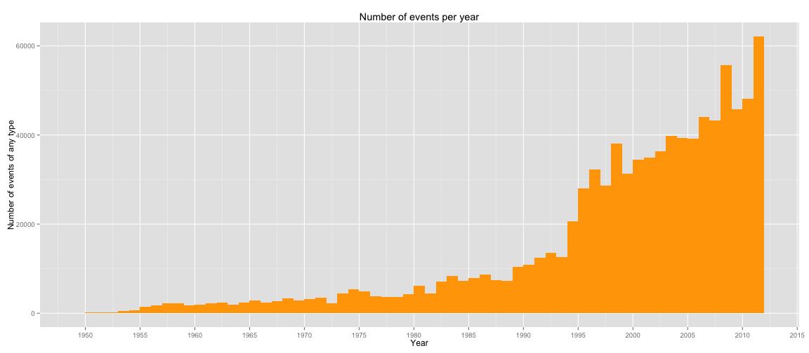
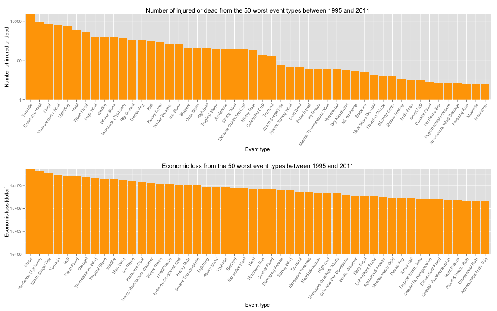

# Severe weather effects on health and economy

## Synopsis

Storms and other severe weather events can cause both public health and economic problems for communities and municipalities. Many severe events can result in fatalities, injuries, and property damage, and preventing such outcomes to the extent possible is a key concern.

This project involves exploring the U.S. National Oceanic and Atmospheric Administration's (NOAA) storm database. This database tracks characteristics of major storms and weather events in the United States, including when and where they occur, as well as estimates of any fatalities, injuries, and property damage.

## Data processing

### Libraries

First we need to load libraries that we will use later.


```r
library(ggplot2)
library(gridExtra)
```

```
## Error: there is no package called 'gridExtra'
```

```r
library(plyr)
library(stringr)
library(magrittr)
library(scales)
```

### Getting and reading data

The  U.S. National Oceanic and Atmospheric Administration's (NOAA) storm database file is downloaded from the Course web site, but only if it doesn't exist. Then we read the comma-separated-value format. 


```r
data_url <- "https://d396qusza40orc.cloudfront.net/repdata%2Fdata%2FStormData.csv.bz2"
filename <- "repdata_data_StormData.csv.bz2"

if (!file.exists(filename)){
	download.file(data_url,filename, method="curl")
}

data <- read.csv(bzfile(filename))
```

### Tidying data

First we would like to have a column names lowercase.


```r
colnames(data) <- colnames(data) %>% tolower()
```

We know that the events in the database start in the year 1950 and end in November 2011. In the earlier years of the database there are generally fewer events recorded, most likely due to a lack of good records. More recent years should be considered more complete.


```r
data$bgn_date = as.POSIXct(data$bgn_date, format = "%m/%d/%Y %H:%M:%S")
data$year <- as.numeric(strftime(data$bgn_date, "%Y"))
```


We see from a histogram that events start to pick up around 1995, so we subset the data.


```r
ggplot(data=data, aes(x=year)) + geom_histogram(binwidth=1, fill="orange") + scale_x_continuous(breaks=pretty_breaks(n=10)) + xlab('Year') + ylab("Number of events of any type") + ggtitle('Number of events per year')
```

 


```r
data = data[data$year >= 1995,]
```
The event types are made up of 799 different strings. 


```r
head(sort(unique(data$evtype)),20)
```

```
##  [1]    HIGH SURF ADVISORY        COASTAL FLOOD             
##  [3]  FLASH FLOOD                 LIGHTNING                 
##  [5]  TSTM WIND                   TSTM WIND (G45)           
##  [7]  WATERSPOUT                  WIND                      
##  [9] ABNORMAL WARMTH             ABNORMALLY DRY             
## [11] ABNORMALLY WET              ACCUMULATED SNOWFALL       
## [13] AGRICULTURAL FREEZE         ASTRONOMICAL HIGH TIDE     
## [15] ASTRONOMICAL LOW TIDE       AVALANCHE                  
## [17] BEACH EROSIN                Beach Erosion              
## [19] BEACH EROSION               BEACH EROSION/COASTAL FLOOD
## 985 Levels:    HIGH SURF ADVISORY  COASTAL FLOOD ... WND
```

As we can see, there are many spelling mistakes (for example "AVALANCE" instead of "AVALANCHE"), abbreviations, untrimmed strings and unnecessarily detailed classes, so we need to fix that. According to [National Weather Service Instruction 10-1605](https://d396qusza40orc.cloudfront.net/repdata%2Fpeer2_doc%2Fpd01016005curr.pdf), there are 48 classes of events. These are manually copied into a CSV-file.


```r
eventtypes <- read.csv('eventtypes_10-1605.csv')
sort(eventtypes$Event.Name)
```

```
##  [1] Astronomical Low Tide    Avalanche               
##  [3] Blizzard                 Coastal Flood           
##  [5] Cold/Wind Chill          Debris Flow             
##  [7] Dense Fog                Dense Smoke             
##  [9] Drought                  Dust Devil              
## [11] Dust Storm               Excessive Heat          
## [13] Extreme Cold/Wind Chill  Flash Flood             
## [15] Flood                    Freezing Fog            
## [17] Frost/Freeze             Funnel Cloud            
## [19] Hail                     Heat                    
## [21] Heavy Rain               Heavy Snow              
## [23] High Surf                High Wind               
## [25] Hurricane (Typhoon)      Ice Storm               
## [27] Lake-Effect Snow         Lakeshore Flood         
## [29] Lightning                Marine Hail             
## [31] Marine High Wind         Marine Strong Wind      
## [33] Marine Thunderstorm Wind Rip Current             
## [35] Seiche                   Sleet                   
## [37] Storm Surge/Tide         Strong Wind             
## [39] Thunderstorm Wind        Tornado                 
## [41] Tropical Depression      Tropical Storm          
## [43] Tsunami                  Volcanic Ash            
## [45] Waterspout               Wildfire                
## [47] Winter Storm             Winter Weather          
## 48 Levels: Astronomical Low Tide Avalanche Blizzard ... Winter Weather
```

The event types are now made up of 799 different strings. First we note that only 73 of the events match any of the accepted values. The values in the data is mixed-case, so let's take care of that first. The values in the accepted list all have the first letter of each word capitalized.


```r
# from ?toupper

simpleCap <- function(x) {
    s <- strsplit(x, " ")[[1]]
    paste(toupper(substring(s, 1, 1)), substring(s, 2),
          sep = "", collapse = " ")
}

data$evtype <- data$evtype %>% tolower() %>% str_trim() %>% sapply(., simpleCap)
```

Now we have 515580 strings matching the accepted.

<!--First we make all values upper case, then change "/" and "&" to "AND" to make it easier on the eyes. We focus on the classes that are the most deadly.-->


```r
# Remove "summary of may 21 " types of events
data <- data[!grepl("^Summary", data$evtype, ignore.case=TRUE),]

data$evtype[data$evtype == "Avalance"] <- "Avalanche"

# Thunderstorms
data$evtype[grepl('Tstm',data$evtype)] <- "Thunderstorm Wind"
data$evtype[grepl('Thunderstormw',data$evtype)] <- "Thunderstorm Wind"
data$evtype[grepl('Thuderstorm',data$evtype)] <- "Thunderstorm Wind"
data$evtype[grepl('Tunderstorm',data$evtype)] <- "Thunderstorm Wind"
data$evtype[grepl('Thunderstorm Winds',data$evtype)] <- "Thunderstorm Wind"
data$evtype[data$evtype == "Severe Thunderstorms"] <- "Thunderstorm Wind"
data$evtype[grepl("THUNDER.*WIND", data$evtype, ignore.case=TRUE ) & !grepl('marine', data$evtype, ignore.case=TRUE)] <- "Thunderstorm Wind"

data$evtype[grepl("^Wild.*Fire", data$evtype)] <- "Wildfire"
data$evtype[data$evtype == "Thunderstorm"] <- "Thunderstorm Wind"

data$evtype[grepl("^Tornado", data$evtype, ignore.case=TRUE)] <- "Tornado"
data$evtype[grepl("w.*spout", data$evtype, ignore.case=TRUE )] <- "Waterspout"

data$evtype[grepl("^Hail.[0-5]*", data$evtype)] <- "Hail"
# Flooding
data$evtype[grepl("Flood",data$evtype, ignore.case=TRUE) & grepl("Flash", data$evtype, ignore.case=TRUE) & !grepl("Coastal", data$evtype, ignore.case=TRUE) & !grepl("Cstl", data$evtype, ignore.case=TRUE) & !grepl("Thunder", data$evtype, ignore.case=TRUE) & !grepl("Ice Storm", data$evtype, ignore.case=TRUE)] <- "Flash Flood"

data$evtype[grepl("Flood",data$evtype, ignore.case=TRUE) & !grepl("Flash", data$evtype, ignore.case=TRUE) & !grepl("Coastal", data$evtype, ignore.case=TRUE) & !grepl("Cstl", data$evtype, ignore.case=TRUE) & !grepl("Wind", data$evtype, ignore.case=TRUE) & !grepl("Rain", data$evtype, ignore.case=TRUE)] <- "Flood"

data$evtype[data$evtype == "Coastal Flooding"] <- "Coastal Flood"

data$evtype[grepl("Tropical Storm", data$evtype), ignore.case = TRUE] <- "Tropical Storm"
```

```
## Error: incorrect number of subscripts on matrix
```

```r
data$evtype[grepl("Fld",data$evtype, ignore.case=TRUE)] <- "Flood"

data$evtype[grepl("Heat",data$evtype, ignore.case=TRUE) & grepl("record",data$evtype, ignore.case=TRUE)] <- "Excessive Heat"
data$evtype[grepl("Heat",data$evtype, ignore.case=TRUE) & grepl("excessive",data$evtype, ignore.case=TRUE)] <- "Excessive Heat"

data$evtype[grepl("Winter Weather",data$evtype, ignore.case=TRUE)] <- "Winter Weather"

data$evtype[grepl("Surf",data$evtype, ignore.case=TRUE) & !grepl("Rip current", data$evtype, ignore.case=TRUE)] <- "High Surf"

data$evtype[data$evtype == "Frost/freeze"] <- "Frost/Freeze"
data$evtype[data$evtype == "Extreme Cold/wind Chill"] <- "Extreme Cold/Wind Chill"
data$evtype[data$evtype == "Extreme Cold"] <- "Extreme Cold/Wind Chill"
data$evtype[data$evtype == "High Winds"] <- "High Wind"
data$evtype[data$evtype == "Lake-effect Snow"] <- "Lake-Effect Snow"
data$evtype[data$evtype == "Snow"] <- "Heavy Snow"
data$evtype[data$evtype == "Cold/wind Chill"] <- "Cold/Wind Chill"
data$evtype[data$evtype == "Cold"] <- "Cold/Wind Chill"
data$evtype[data$evtype == "Cold And Snow"] <- "Cold/Wind Chill"

data$evtype[data$evtype == "Extreme Windchill"] <- "Extreme Cold/Wind Chill"
data$evtype[data$evtype == "Fog"] <- "Dense Fog"
data$evtype[data$evtype == "Wind"] <- "High Wind"
data$evtype[data$evtype == "Rip Currents"] <- "Rip Current"
data$evtype[data$evtype == "Storm Surge"] <- "Storm Surge/Tide"
data$evtype[data$evtype == "Storm Surge/tide"] <- "Storm Surge/Tide"
data$evtype[data$evtype == "Record Warmth"] <- "Excessive Heat"
data$evtype[data$evtype == "Extreme Heat"] <- "Excessive Heat"

data$evtype[data$evtype == "Unseasonably Warm And Dry"] <- "Heat"
data$evtype[data$evtype == "Excessive Rainfall"] <- "Heavy Rain"

data$evtype[data$evtype == "Glaze"] <- "Ice Storm"
data$evtype[data$evtype == "Hurricane"] <- "Hurricane (Typhoon)"
data$evtype[data$evtype == "Hurricane/typhoon"] <- "Hurricane (Typhoon)"

data$evtype[data$evtype == "Unseasonably Warm"] <- "Heat"
data$evtype[data$evtype == "Heat Wave"] <- "Heat"
data$evtype[data$evtype == "Funnel Clouds"] <- "Funnel Cloud"
data$evtype[data$evtype == "Waterspouts"] <- "Waterspout"

data$evtype[data$evtype == "Strong Winds"] <- "High Wind"
data$evtype[data$evtype == "Gusty Winds"] <- "High Wind"
data$evtype[data$evtype == "Winter Storm High Winds"] <- "High Wind"
data$evtype[data$evtype == "Rough Seas"] <- "Marine Strong Wind"

data$evtype[data$evtype == "Freeze"] <- "Frost/Freeze"
data$evtype[data$evtype == "Frost"] <- "Frost/Freeze"

# Light snow should be Winter Weather...
data$evtype[data$evtype == "Light Snow"] <- "Winter Weather"

data$evtype[data$evtype == "Wintry Mix"] <- "Winter Weather"

# Remove Landslides, since not in list
data$evtype[data$evtype == "Landslide"] <- NA
```

Now we have 678520 or 99.5737 \% strings matching the accepted. Of the event types not in the accepted list, here are the 10 event types with most entries.


```r
data$evtype[!data$evtype %in% eventtypes$Event.Name] %>% table() %>% sort(., decreasing=T) %>% head(.,10)
```

```
## data$evtype[!data$evtype %in% eventtypes$Event.Name]
##          Freezing Rain         Dry Microburst Astronomical High Tide 
##                    223                    183                    103 
##      Moderate Snowfall       Unseasonably Dry                  Other 
##                    101                     56                     52 
##             Small Hail     Temperature Record            Record Cold 
##                     52                     43                     41 
##    Mixed Precipitation 
##                     37
```

We would like to have one variable per column, but for property and crop damage, this is not the case.

Property damage is listed in 'propdmg' and 'propdmgexp' where the latter can take on the values


```r
levels(data$propdmgexp)
```

```
##  [1] ""  "-" "?" "+" "0" "1" "2" "3" "4" "5" "6" "7" "8" "B" "h" "H" "K"
## [18] "m" "M"
```

For crop damage we have the two columns 'cropdmg' and 'cropdmgexp'.


```r
levels(data$cropdmgexp)
```

```
## [1] ""  "?" "0" "2" "B" "k" "K" "m" "M"
```

From the [National Weather Service Instruction 10-1605](https://d396qusza40orc.cloudfront.net/repdata%2Fpeer2_doc%2Fpd01016005curr.pdf) we see that "Alphabetical characters used to signify magnitude include “K” for thousands, “M” for millions, and “B” for billions." We can only assume that 'h' and 'H' means hundred.


```r
data$cropdmgexp <- toupper(data$cropdmgexp)
data$cropdmgexp[data$cropdmgexp == "B"] <- "9"
data$cropdmgexp[data$cropdmgexp == "M"] <- "6"
data$cropdmgexp[data$cropdmgexp == "K"] <- "3"
data$cropdmgexp[data$cropdmgexp == "H"] <- "2"
data$cropdmgexp[data$cropdmgexp == ""] <- "0"
data$cropdmgexp <- as.numeric(data$cropdmgexp)
```

```
## Warning: NAs introduced by coercion
```

```r
data$cropdamage = data$cropdmg * 10^data$cropdmgexp

data$propdmgexp <- toupper(data$propdmgexp)
data$propdmgexp[data$propdmgexp == "B"] <- "9"
data$propdmgexp[data$propdmgexp == "M"] <- "6"
data$propdmgexp[data$propdmgexp == "K"] <- "3"
data$propdmgexp[data$propdmgexp == "H"] <- "2"
data$propdmgexp[data$propdmgexp == ""] <- "0"
data$propdmgexp[data$propdmgexp == "-"] <- "0"
data$propdmgexp[data$propdmgexp == "+"] <- "0"
data$propdmgexp <- as.numeric(data$propdmgexp)
```

```
## Warning: NAs introduced by coercion
```

```r
data$propdamage = data$propdmg * 10^data$propdmgexp
```

# Results
## Most harmful events with respect to population health

We would like to find the most harmful event types with respect to human health. We sum together injuries and fatalities, so we disregard the seriousness of fatalities versus injuries.


```r
a <- aggregate(data=data, fatalities+injuries~evtype,FUN=sum)
colnames(a) <- c("evtype","count")
# Sort by sum
a <- a[order(-a$count),]

# Make the factor reflect the order
a$evtype <- factor(a$evtype, a$evtype)

# Pick out the 50 worst event types
a <- head(a,50)

health <- ggplot(data=a, aes(x = evtype, y = count)) +
	geom_bar(stat="identity", fill="orange") +
	theme(axis.text.x = element_text(angle = 55, hjust = 1)) +
	scale_y_log10(expand=c(0,0)) +
	ylab("Number of injured or dead") +
	xlab("Event type") +
	ggtitle("Number of injured or dead from the 50 worst event types between 1995 and 2011")
```

## Most costly economic consequences

We treat crop damage and property with equal weight.


```r
a <- aggregate(data=data, cropdamage+propdamage~evtype,FUN=sum)
colnames(a) <- c("evtype","dollar")
# Sort by sum
a <- a[order(-a$dollar),]

# Make the factor reflect the order
a$evtype <- factor(a$evtype, a$evtype)

# Pick out the 50 worst event types
a <- head(a,50)

damage <- ggplot(data=a, aes(x = evtype, y = dollar)) +
	geom_bar(stat="identity", fill="orange") +
	theme(axis.text.x = element_text(angle = 55, hjust = 1)) +
	scale_y_log10(expand=c(0,0)) +
	ylab("Economic loss [dollar]") +
	xlab("Event type") +
	ggtitle("Economic loss from the 50 worst event types between 1995 and 2011")
```


```r
ggHealth <- ggplotGrob(health)
ggDamage <- ggplotGrob(damage)

maxWidth <- unit.pmax(
	ggHealth$widths,
	ggDamage$widths
	)

ggHealth$widths <- maxWidth
ggDamage$widths <- maxWidth

grid.arrange(ggHealth, ggDamage, ncol=1)
```

 


